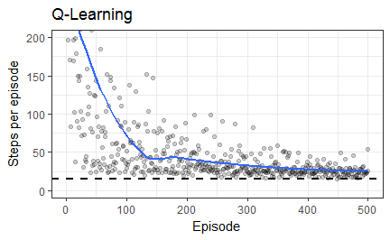
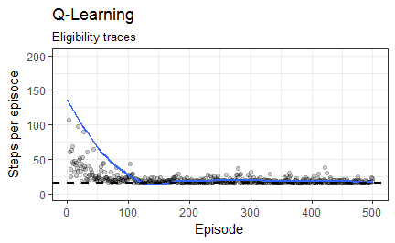
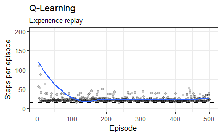
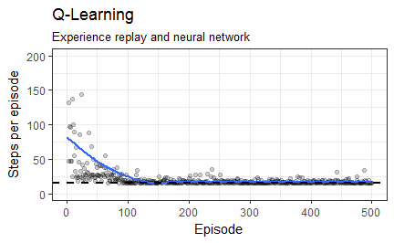

Benchmark Algorithms on Windy Gridworld Task
================
Markus Dumke
2017-12-21

``` r
library(reinforcelearn)
env = makeEnvironment("windy.gridworld")
```

The optimal solution is 15 steps.

Simple Q-Learning
-----------------

``` r
policy = makePolicy("epsilon.greedy", epsilon = 0.1)
agent = makeAgent(policy, "table", "qlearning", epsilon = 0.1)

res = interact(env, agent, n.episodes = 500L)
```



Q-Learning with Eligibility Traces
----------------------------------

``` r
env$resetEverything()
#> [1] 30
policy = makePolicy("epsilon.greedy", epsilon = 0.1)
alg = makeAlgorithm("qlearning", lambda = 0.8, traces = "accumulate")
agent = makeAgent(policy, "table", alg)

res = interact(env, agent, n.episodes = 500L)
```



Q-Learning with Experience replay
---------------------------------

``` r
env$resetEverything()
#> [1] 30
policy = makePolicy("epsilon.greedy", epsilon = 0.1)
mem = makeReplayMemory(size = 10L, batch.size = 10L)
agent = makeAgent(policy, "table", "qlearning", experience.replay = mem)

res = interact(env, agent, n.episodes = 500L)
```



Q-Learning with neural network and experience replay
----------------------------------------------------

``` r
env$resetEverything()
#> [1] 30
library(keras)
model = keras_model_sequential() %>%
  layer_dense(units = env$n.actions, activation = "linear",
    input_shape = c(env$n.states), kernel_initializer = initializer_zeros(),
    use_bias = FALSE) %>%
  compile(loss = "mae", optimizer = optimizer_sgd(lr = 1))
mem = makeReplayMemory(size = 2L, batch.size = 2L)
val = makeValueFunction("neural.network", model = model)
policy = makePolicy("epsilon.greedy", epsilon = 0.1)
preprocess = function(x) to_categorical(x, num_classes = env$n.states)
agent = makeAgent(policy, val, "qlearning",
  preprocess = preprocess, experience.replay = mem)

res = interact(env, agent, n.episodes = 500L)
```


