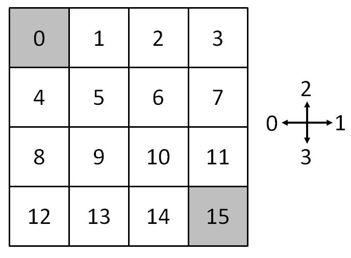
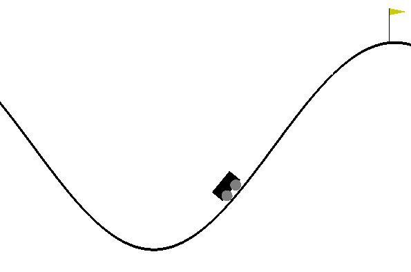

```{r setup, include=FALSE}
knitr::opts_chunk$set(echo = TRUE)
```

This vignette explains the different possibilities to create a reinforcement learning environment in `reinforcelearn`.

```{r}
library(reinforcelearn)
set.seed(1)
```

---

## What is an environment in reinforcelearn?

Environments in `reinforcelearn` are implemented as `R6` classes with certain methods and attributes. 
The environment can then be passed on to the algorithms using the `envir` argument.

There are some attributes of the `R6` class, which are essential for the interaction between environment and agent:

- `state`: The current state observation of the environment. Depending on the problem this can be anything, e.g. a scalar integer, a matrix or a list.

- `reward`: The current reward of the environment. It is always a scalar numeric value.

- `done`: A logical flag specifying whether an episode is finished.

- `n.steps`: Number of steps in the current episode. Will be reset to 0 when `reset` is called. Each time `step` is called it is increased by 1.

The interaction between agent and environment is done via the `reset` and `step` methods:

- `reset()`: Resets the environment, i.e. it sets the `state` attribute to a starting state and sets the `done` flag to `FALSE`. It is usually called at the beginning of an episode. 

- `step(action)`: The basic interaction function between agent and environment. `step` is called with an action as an argument. It then takes the action and alters the `state` and `reward` attributes of the `R6` class. If the episode is done, e.g. a terminal state reached, the `done` flag is set to `TRUE`.

Note: All states and actions are numerated starting with 0!

The `makeEnvironment` function provides different ways to create an environment. It takes care of the creation of an `R6` class with the above mentioned attributes and methods.

---

### Markov Decision Process

A Markov Decision Process (MDP) is a stochastic process, which is commonly used for reinforcement learning environments.
When the problem can be formulated as a MDP, all you need to pass to `makeEnvironment` is the state transition array $P^a_{ss'}$ and reward matrix $R_s^a$ of the MDP. The state transition array describes the probability of a transition from state $s$ to state $s'$ when taking action $a$.
It is a 3-dimensional array with dimensions [number of states x number of states x number of actions], so for each action there is one state transition matrix. The reward matrix has the dimensions [number of states x number of actions], each entry is the expected reward obtained from taking action $a$ in a state $s$.

We can create a simple MDP with 2 states and 2 actions with the following code.

```{r}
# State transition array
P = array(0, c(2, 2, 2))
P[, , 1] = matrix(c(0.5, 0.5, 0.8, 0.2), 2, 2, byrow = TRUE)
P[, , 2] = matrix(c(0, 1, 0.1, 0.9), 2, 2, byrow = TRUE)
print(P)
# Reward matrix
R = matrix(c(5, 10, -1, 2), 2, 2, byrow = TRUE)
print(R)
env = makeEnvironment(transitions = P, rewards = R)
```

We will get a warning that there are no terminal states in the MDP, i.e. an episode never ends in this MDP. Some algorithms assume that there is a terminal state, so we have to be careful, when we want to solve this. A terminal state has a probability of 1 remaining in this state. Here is an example.

```{r}
P = array(0, c(2, 2, 2))
P[, , 1] = matrix(c(0.5, 0.5, 0, 1), 2, 2, byrow = TRUE)
P[, , 2] = matrix(c(0.1, 0.9, 0, 1), 2, 2, byrow = TRUE)
print(P)

env = makeEnvironment(transitions = P, rewards = R)
print(env$terminal.states)
```

Every episode starts in some starting state. There are different ways to pass on the starting state in `makeEnvironment`. The simplest is to specify the `initial.state` argument with a scalar integer or an integer vector. When `initial.state` is a scalar, then every episode will start in this state. If `initial.state` is a vector then the starting state will be uniformly sampled from all elements of the vector. As a default the initial state will be sampled randomly from all non-terminal states.

```{r}
env = makeEnvironment(transitions = P, rewards = R, initial.state = 0)
env$reset()
print(env)
```

A different possibility is to specify a custom `reset` function, which takes no arguments and returns the starting state. This is a way to specify a custom probability distribution over starting states. If the starting state is a terminal state you will get a warning!

```{r}
# Specify a custom probability distribution for the starting state.
reset = function() {
  p = c(0.2, 0.8)
  sample(0:1, prob = p, size = 1)
}
env = makeEnvironment(transitions = P, rewards = R, reset = reset)
env$reset()
print(env)
```

The reward argument can also be a three-dimensional array, i.e. the reward can also depend on the next state.

```{r}
R = array(0, c(2, 2, 2))
R[, 1, ] = 1
R[2, 2, 2] = 10
print(R)

env = makeEnvironment(transitions = P, rewards = R)

env$reset()
env$step(1)
print(env)
```

Instead of specifying a reward array you can also pass on a function `sampleReward`, which takes three arguments, the current state, action and next state and returns a scalar numeric reward. This way the reward of taking an action can be stochastic. Here is a simple example, where the reward is either 0 or sampled from a normal distribution depending on the next state and action.

```{r}
sampleReward = function(state, action, n.state) {
  if (n.state == 0 & action == 1L) {
    0
  } else {
    rnorm(1)
  }
}
env = makeEnvironment(transitions = P, sampleReward = sampleReward)
env$reset()
env$step(0)
print(env)
```

### Gridworld Environments

A gridworld is a simple navigation task, where the goal is to get from some starting state to a goal state. Gridworlds are MDPsand the function `makeGridworld` can be used to create gridworlds of different shapes and properties. Possible actions are going left, right, up and down. If `diagonal.moves = TRUE` diagonal moves are also possible. States and actions are numerated starting with 0. `makeGridworld` computes the state transition array and reward matrix of the specfied gridworld and then calls `makeEnvironment` internal. Arguments can be passed on to `makeEnvironment` via the `...`argument, e.g. `initial.state`.

Here is an example of a 4x4 grid with the standard actions and two terminal states in the lower right and upper left of the grid. Rewards are - 1 for every transition until reaching a terminal state. States are always numerated row-wise starting with 0.

```{r, out.width = "300px", fig.align="center", echo = FALSE}

```

The following code creates this gridworld. 

```{r}
# Gridworld Environment (Sutton & Barto (2017) Example 4.1)
env = makeGridworld(shape = c(4, 4), goal.states = c(0, 15))
print(env$states)
print(env$actions)

# Same gridworld, but with diagonal moves
env = makeGridworld(shape = c(4, 4), goal.states = c(0, 15), 
  diagonal.moves = TRUE)
print(env$actions)
```

A cliff state is a state with a high negative reward and a transition to some other state. You can specify a cliff walking gridworld via the `cliff.states`, `cliff.transition.states` and `reward.cliff` arguments.

```{r}
# Cliff Walking (Sutton & Barto (2017) Example 6.6)   
cliff = makeGridworld(shape = c(4, 12), goal.states = 47, 
  cliff.states = 37:46, reward.step = - 1, reward.cliff = - 100, 
  cliff.transition.states = 36, initial.state = 36)
```

Actions will deterministically change the state, e.g. when going left from state 5 in the gridworld in the figure the new state will always be 4. A stochastic gridworld can be specified via the `stochasticity` argument. Then the next state will be randomly sampled from all eight successor state with probability `stochasticity`.

```{r}
# Gridworld with 10% random transitions
env = makeGridworld(shape = c(4, 4), goal.states = c(0, 15), stochasticity = 0.1)
```

A windy gridworld is a variant, where the agent will be pushed up a number of cells when transitioning into a column with an upward wind. The `wind` argument specifies the strength of this wind. It is an integer vector with the same size as the number of columns in the grid. Here is an example creating a windy gridworld environment.

```{r}
# Windy Gridworld (Sutton & Barto (2017) Example 6.5) 
windy.gridworld = makeGridworld(shape = c(7, 10), goal.states = 37, 
  reward.step = - 1, wind = c(0, 0, 0, 1, 1, 1, 2, 2, 1, 0), initial.state = 30)
```

---

### OpenAI Gym Environments

OpenAI Gym is a toolkit for developing and comparing reinforcement learning algorithms.  It provides a set of environments, which can be used as benchmark problems. The environments are implemented in Python and can be acessed via the OpenAI Gym API. To use this in R you need to install the dependencies listed [here](https://github.com/openai/gym-http-api). You also need to install the R package `gym`.

Then it is simple to use one of the existing Gym environments by passing on the name of the environment via the `gym.envir.name` argument in `makeEnvironment`. Have a look at [https://gym.openai.com/envs](https://gym.openai.com/envs) for possible environments.

```{r, eval = FALSE}
# Note: There is a bug: The following line might return an error. 
# Calling the following line twice should solve this.
env = makeEnvironment("MountainCar-v0", render = TRUE)
```

The `render` argument specifies whether to render the environment. If `render = TRUE` a Python window will open showing a graphical interface of the environment when calling the `step` method.

The `reset`, `step` and `close` method can then be used to sample experience. Here is an example running a random agent for 200 steps on the mountain car task.

```{r, eval = FALSE}
env$reset()
for (i in 1:200) {
  action = sample(env$actions, 1)
  env$step(action)
}
env$close()
```

You should see a window opening showing the graphical interface.

```{r, out.width = "300px", fig.align="center", echo = FALSE}

```
---

### Create your own environment

Some reinforcement learning problems cannot be formulated in the above way. Then it is necessary to create the environment yourself and pass it on to the algorithms. Make sure, that the environment is an `R6 class` with certain attributes and methods.

Depending on the algorithm different of these attributes and methods may be necessary, e.g. `terminal.states`, `rewards` and `transitions` for model-based dynamic programming or `step`, `reset`, `state`, `reward` and `done`, if using a model-free algorithm.

Here is a full list describing all attributes of the `R6` class created by `makeEnvironment`.

- `state`: The current state observation of the environment. Depending on the problem this can be anything, e.g. a scalar integer, a matrix or a list.

- `reward`: The current reward of the environment. It is always a scalar numeric value.

- `done`: A logical flag specifying whether an episode is finished.

- `n.steps`: Number of steps in the current episode. Will be reset to 0 when `reset` is called. Each time `step` is called it is increased by 1.

- `previous.state`: The previous state of the environment. This is often the state which is updated in a reinforcement learning algorithm.

- `state.space`: One of `Discrete` or `Box`.

- `state.shape`: Number of state variables in a continuous state space.

- `state.space.bounds`: The bounds of a boxed state space, a list with lower and upper bound for each state variable as one list element.

- `states`: States (in a discrete state space). Numerated starting with 0.

- `terminal.states`: Terminal states in a Markov Decision Process. Will be derived from the `transition` argument in `makeEnvironment`.

- `n.states`: Number of states (for a discrete state space).

- `action.space`: One of `Discrete` or `Box`.

- `action.shape`: Number of action variables in a continuous action space.

- `action.space.bounds`: The bounds of a boxed action space, a list with lower and upper bound for each action variable as one list element.

- `actions`: Actions (in a discrete action space). Numerated starting with 0.

- `n.actions`: Number of actions (for a discrete action space).

- `transitions`: A state transition array (n.states x n.states x n.actions).

- `rewards`: A state reward matrix (n.states x n.actions).

These are the methods:

- `reset()`: Resets the environment, i.e. it sets the `state` attribute to a starting state and sets the `done` flag to `FALSE`. It is usually called at the beginning of an episode. 

- `step(action)`: The basic interaction function between agent and environment. `step` is called with an action as an argument. It then takes the action and alters the `state` and `reward` attributes of the `R6` class. If the episode is done, e.g. a terminal state reached, the `done` flag is set to `TRUE`.

- `done()`: When using an OpenAI Gym environment this method closes the python window. Else it returns the `R6` class object unchanged, i.e. `self$close = function() {invisible(self)}`.

---

Here is an example creating the Mountain Car environment yourself.

```{r}
MountainCar = R6::R6Class("MountainCar", 
  public = list(
    action.space = "Discrete",
    actions = 0:2,
    n.actions = 3,
    state.space = "Box",
    state.space.bounds = list(c(-1.2, 0.6), c(-0.07, 0.07)),
    done = FALSE,
    n.steps = 0,
    state = NULL,
    previous.state = NULL,
    reward = NULL,
    velocity = NULL,
    position = NULL,
    
    reset = function() {
      self$n.steps = 0
      self$previous.state = NULL
      self$done = FALSE
      self$position = runif(1, - 0.6, - 0.4)
      self$velocity = 0
      self$state = matrix(c(self$position, self$velocity), ncol = 2)
      invisible(self)
    },
    
    step = function(action) {
      self$previous.state = self$state
      self$n.steps = self$n.steps + 1
      
      self$velocity = self$velocity + 0.001 * (action - 1) - 
        0.0025 * cos(3 * self$position)
      if (self$velocity < self$state.space.bounds[[2]][1]) {
        self$velocity = self$state.space.bounds[[2]][1]
      }
      if (self$velocity > self$state.space.bounds[[2]][2]) {
        self$velocity = self$state.space.bounds[[2]][2]
      }
      self$position = self$position + self$velocity
      if (self$position < self$state.space.bounds[[1]][1]) {
        self$position = self$state.space.bounds[[1]][1]
        self$velocity = 0
      }
      
      self$state = matrix(c(self$position, self$velocity), ncol = 2)
      self$reward = - 1
      if (self$position >= 0.5) {
        self$done = TRUE
        self$reward = 0
      }
      invisible(self)
    },
    
    close = function() {
      invisible(self)
    }
  )
)
```

Then we can use this to generate samples.

```{r}
m = MountainCar$new()
set.seed(123456)
m$reset()
while(!m$done) {
  action = sample(m$actions, 1)
  m$step(action)
}
print(paste("Episode finished after", m$n.steps, "steps."))
```

Note: The mountain car implementation above is already included in the package and can be called with the `MountainCar` function.

```{r}
# Mountain Car with discrete action space
m = MountainCar()
m$reset()
m$step(1)
print(m)
```

There is also a variant with a continuous (boxed) action space

```{r}
# Mountain Car with continuous action space
m = MountainCar(action.space = "Continuous")
m$reset()
m$step(0.27541)
print(m)
```

---

Have a look at the other vignettes: [Introduction to reinforcelearn](introduction.html) and [How to solve an environment?](algorithms.html).

Author: Markus Dumke
