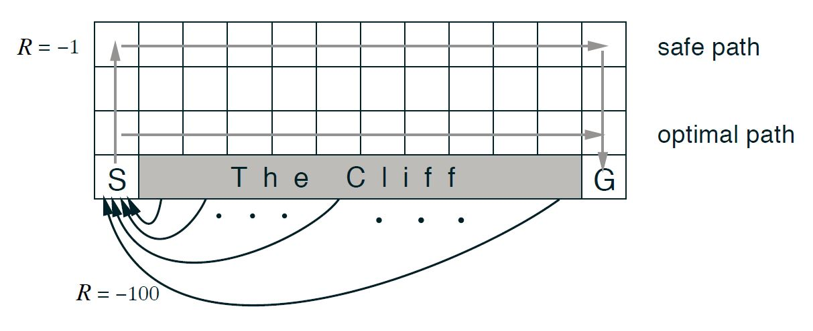
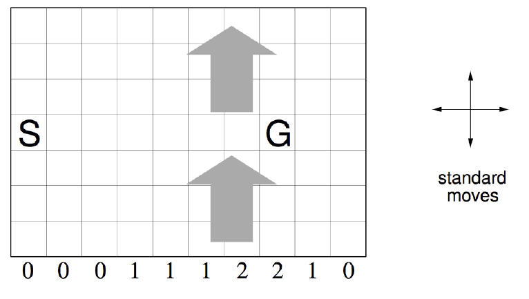

<style type="text/css">
h1.title {
  font-size: 34px;
}
</style>

```{r setup, include=FALSE}
knitr::opts_chunk$set(message = FALSE, eval = TRUE, collapse = TRUE, comment = "#>")
```

This vignette explains the different possibilities to create a reinforcement learning environment in `reinforcelearn`.

```{r}
library(reinforcelearn)
set.seed(1)
```

---

<!-- ## What is an environment in reinforcement learning? -->


<!-- --- -->

## What object represents an environment in `reinforcelearn`?

Environments in `reinforcelearn` are implemented as `R6` classes with certain methods and attributes. 
The environment can then be passed on to the algorithms using the `envir` argument.

There are some attributes of the `R6` class, which are essential for the interaction between environment and agent:

- `state`: The current state observation of the environment. Depending on the problem this can be anything, e.g. a scalar integer, a matrix or a list.

- `reward`: The current reward of the environment. It is always a scalar numeric value.

- `done`: A logical flag specifying whether an episode is finished.

The interaction between agent and environment is done via the `reset` and `step` methods:

- `reset()`: Resets the environment, i.e. it sets the `state` attribute to a starting state and sets the `done` flag to `FALSE`. It is usually called at the beginning of an episode. 

- `step(action)`: The interaction function between agent and environment. `step` is called with an action as an argument. It then takes the action and internally computes the following state, reward and whether an episode is finished and returns a list with `state`, `reward` and `done`.

Note: All discrete states and actions are numerated starting with 0!

---

## How to create an environment?

The `makeEnvironment` function provides different ways to create an environment.
It is called with . You can pass arguments of the specific environment type (e.g. the state transition array for an MDP) to the `...` argument.

### Create a custom environment

To create a custom environment you have to set up a `step` and `reset` function.

### OpenAI Gym

OpenAI Gym [@gym_openai] is a toolkit for developing and comparing reinforcement learning algorithms.  It provides a set of environments, which can be used as benchmark problems. The environments are implemented in python and can be accessed via the OpenAI Gym API. Have a look at [https://gym.openai.com/envs](https://gym.openai.com/envs) for possible environments. To use this in R you need to install the dependencies listed [here](https://github.com/openai/gym-http-api). You also need to install the R package `gym` [@gym].

Then it is simple to use one of the existing OpenAI Gym environments. First you need to start the python server. Open a terminal and manually start the file `gym_http_server.py` inside the gym_http_api folder. You can also start the python server from R, here using a copy of the file included in the `reinforcelearn` package. 

```{r, eval = FALSE}
# Create an OpenAI Gym environment.
# Make sure you have Python and Gym installed.
# Start server from within R.
package.path = system.file(package = "reinforcelearn")
path2pythonfile = paste0(package.path, "/gym_http_server.py")
system2("python", args = path2pythonfile, stdout = NULL, 
  wait = FALSE, invisible = FALSE)

env = makeEnvironment("MountainCar-v0")
```

The `render` argument specifies whether to render the environment. If `render = TRUE` a python window will open showing a graphical interface of the environment when calling the `step` method.

The `reset`, `step` and `close` method can then be used to sample experience. Here is an example running a random agent for 200 steps on the mountain car task.

```{r, eval = FALSE}
env$reset()
for (i in 1:200) {
  action = sample(env$actions, 1)
  env$step(action)
}
env$close()
```

You should see a window opening showing the graphical interface.

```{r, out.width = "300px", fig.align="center", echo = FALSE}
knitr::include_graphics("mountaincar.JPG")
```

---

### Markov Decision Process

A Markov Decision Process (MDP) is a stochastic process, which is commonly used for reinforcement learning environments.
When the problem can be formulated as a MDP, all you need to pass to `makeEnvironment` is the state transition array $P^a_{ss'}$ and reward matrix $R_s^a$ of the MDP. The state transition array describes the probability of a transition from state $s$ to state $s'$ when taking action $a$.
It is a 3-dimensional array with dimensions [number of states x number of states x number of actions], so for each action there is one state transition matrix. The reward matrix has the dimensions [number of states x number of actions], each entry is the expected reward obtained from taking action $a$ in a state $s$.

We can create a simple MDP with 2 states and 2 actions with the following code.

```{r}
# State transition array
P = array(0, c(2, 2, 2))
P[, , 1] = matrix(c(0.5, 0.5, 0.8, 0.2), 2, 2, byrow = TRUE)
P[, , 2] = matrix(c(0, 1, 0.1, 0.9), 2, 2, byrow = TRUE)
print(P)
# Reward matrix
R = matrix(c(5, 10, -1, 2), 2, 2, byrow = TRUE)
print(R)
env = makeEnvironment("MDP", transitions = P, rewards = R)
```

We will get a warning that there are no terminal states in the MDP, i.e. an episode never ends in this MDP. Some algorithms assume that there is a terminal state, so we have to be careful, when we want to solve this. A terminal state has a probability of 1 remaining in this state. Here is an example.

```{r}
P = array(0, c(2, 2, 2))
P[, , 1] = matrix(c(0.5, 0.5, 0, 1), 2, 2, byrow = TRUE)
P[, , 2] = matrix(c(0.1, 0.9, 0, 1), 2, 2, byrow = TRUE)
print(P)

env = makeEnvironment("MDP", transitions = P, rewards = R)
print(env$terminal.states)
```

Every episode starts in some starting state. There are different ways to pass on the starting state in `makeEnvironment`. The simplest is to specify the `initial.state` argument with a scalar integer or an integer vector. When `initial.state` is a scalar every episode will start in this state. If `initial.state` is a vector then the starting state will be uniformly sampled from all elements of the vector. As a default the initial state will be sampled randomly from all non-terminal states.

```{r}
env = makeEnvironment("MDP", transitions = P, rewards = R, initial.state = 0L)
env$reset()
```

---

### Gridworld

A gridworld is a simple MDP navigation task with a discrete state and action space. The agent has to move through a grid from a start state to a goal state. Each episode starts in the start state and  terminates if the agent reaches a goal state. States are always numerated row-wise starting with 0. Possible actions are the standard moves (left, right, up, down) or could also include the diagonal moves (leftup, leftdown, rightup, rightdown).

If an action would take the agent off the grid, the next state will be the nearest cell inside the grid. For each step the agent gets a reward, e.g. - 1, until it reaches a goal state, then the episode is done.

Gridworlds with different shapes, rewards and transition dynamics can be created with the function `gridworld`. It computes the state transition array and reward matrix of the specified gridworld (because a gridworld is a MDP) and then internally calls `makeEnvironment`. Arguments from `makeEnvironment` can be passed on via the `...` argument, e.g. `initial.state`.

Here is an example of a 4x4 gridworld [@sutton2017, Example 4.1] with the 4 standard actions and two terminal states in the lower right and upper left of the grid. Rewards are - 1 for every transition until reaching a terminal state. 

```{r, out.width = "300px", fig.align="center", echo = FALSE}
knitr::include_graphics("gridworld.JPG")
```

The following code creates this gridworld.

```{r}
# Gridworld Environment (Sutton & Barto (2017) Example 4.1)
env = makeEnvironment("Gridworld", shape = c(4, 4), goal.states = c(0, 15))
env$states
env$actions
```

<!-- In this gridworld actions will deterministically change the state, e.g. when going left from state 5 the new state will always be 4. A stochastic gridworld can be specified via the `stochasticity` argument. Then the next state will be randomly sampled from all eight successor state with a probability `stochasticity`. -->

<!-- ```{r} -->
<!-- # Gridworld with 10% random transitions -->
<!-- env = gridworld(shape = c(4, 4), goal.states = c(0, 15), stochasticity = 0.1) -->
<!-- ``` -->

<!-- ```{r, out.width = "500px", fig.align = "center", echo = FALSE} -->
<!--  -->
<!-- ``` -->

<!-- The cliff walking gridworld [@sutton2017, Example 6.6] has a cliff in the lower part of the grid. Stepping into this cliff will result in a high negative reward of -100 and a transition back to the starting state in the lower left part of the grid. So the agent has to learn to avoid stepping into this cliff. Other transitions have the usual reward of -1.  The optimal path is directly above the cliff, while the safe path runs at the top of the gridworld far away from the dangerous cliff. -->

<!-- In `gridworld` we can specify a cliff via the `cliff.states` argument and the reward when stepping into the cliff via `reward.cliff`. The states to which the agent transitions, when stepping into the cliff can be specified via `cliff.transition.states`. -->

<!-- ```{r} -->
<!-- # Cliff Walking (Sutton & Barto (2017) Example 6.6)    -->
<!-- env = gridworld(shape = c(4, 12), goal.states = 47,  -->
<!--   cliff.states = 37:46, reward.step = - 1, reward.cliff = - 100,  -->
<!--   cliff.transition.states = 36, initial.state = 36) -->

<!-- # Identical to the above call -->
<!-- env = cliff() -->
<!-- ``` -->

<!-- ```{r, out.width = "350px", fig.align = "center", echo = FALSE} -->
<!--  -->
<!-- ``` -->

<!-- The windy gridworld [@sutton2017, Example 6.5] is a gridworld with shape 7x10. The agent will be pushed up a number of cells when transitioning into a column with an upward wind. The `wind` argument specifies the strength of this wind. It is an integer vector with the same size as the number of columns in the grid. E.g. going right from the state directly left to the goal, will push the agent to a state two cells above the goal. The reward for each step is -1. -->

<!-- ```{r} -->
<!-- # Windy Gridworld (Sutton & Barto (2017) Example 6.5)  -->
<!-- env = gridworld(shape = c(7, 10), goal.states = 37,  -->
<!--   reward.step = - 1, wind = c(0, 0, 0, 1, 1, 1, 2, 2, 1, 0), initial.state = 30) -->

<!-- # Identical to the above call -->
<!-- env = windyGridworld() -->
<!-- ``` -->

---

### Full list of attributes and methods:

Here is a full list describing the attributes of the `R6` class created by `makeEnvironment`.

**Attributes**:

- `state` [any]: The current state observation of the environment. Depending on the problem this can be anything, e.g. a scalar integer, a matrix or a list.

- `reward` [integer(1)]: The current reward of the environment. It is always a scalar numeric value.

- `done` [logical(1)]: A logical flag specifying whether an episode is finished.

- `discount` [numeric(1) in [0, 1]]: The discount factor.

- `n.step` [integer(1)]: Number of steps, i.e. number of times `$step()` has been called.

- `episode.step` [integer(1)]: Number of steps in the current episode. In comparison to `n.step` it will be reset to 0 when `reset` is called. Each time `step` is called it is increased by 1.

- `episode.return` [numeric(1)]: The return in the current episode. Each time `step` is called the discounted `reward` is added. Will be reset to 0 when `reset` is called.

- `previous.state` [any]: The previous state of the environment. This is often the state which is updated in a reinforcement learning algorithm.

**Methods**:

- `reset()`: Resets the environment, i.e. it sets the `state` attribute to a starting state and sets the `done` flag to `FALSE`. It is usually called at the beginning of an episode. 

- `step(action)`: The interaction function between agent and environment. `step` is called with an action as an argument. It then takes the action and internally computes the following state, reward and whether an episode is finished and returns a list with `state`, `reward` and `done`.

- `visualize()`: Visualize the current state of the environment.

---

### Other vignettes

Have a look at the other vignettes: 

- [How to solve an environment?](algorithms.html)

---

### References
