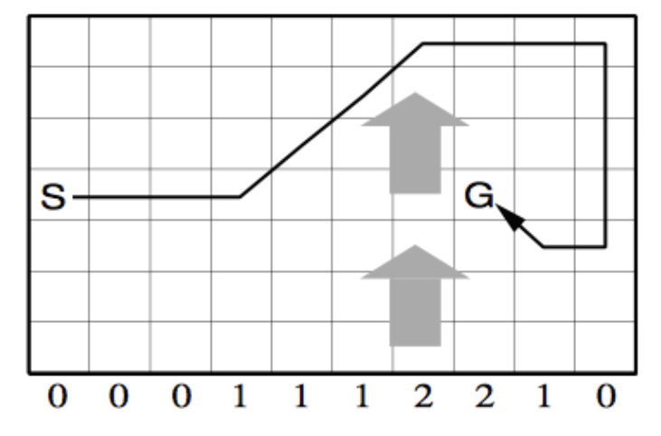

  
## Windy Gridworld
  
The windy gridworld is a simple example from Sutton & Barto (2017). The goal is to move from a starting state (S) to a goal state (G) as fast as possible, because each step you receive a negative reward of -1 along the way. You can move along the grid using the standard moves (left, right, up and down). In each column of the grid a deterministic wind pushes you up a certain number of steps. E.g. if you are in the cell to the left of the goal state and go right, you will end up two cells above the goal.
 
<div class="figure">

<p class="caption">Windy gridworld example, image from D.Silver</p>
</div>

## SARSA

SARSA is an off-policy control algorithm using temporal-difference learning. Given a state and action pair the next state $S'$ and Reward $R$ are sampled from the environment. Then following an $\epsilon$-greedy policy the next action $A'$ is sampled. The action value of $S$ and $A$ is then updated towards the observed reward plus a discounted (discount factor $\gamma$) of the subsequent state action pair $(S', A')$.

The update equation is: 

$Q(S, A) \leftarrow  Q(S, A) + \alpha[R + \gamma Q(S', A') - Q(S, A)]$

In the following we will solve the windy gridworld problem, i.e. find the shortest path from the start state to the goal state. First we load the `reinforcelearn` package and create the environment. 

```{r}
library(reinforcelearn)
grid = windyGridworld$new()
```

Then we can apply SARSA to find the optimal action value function $Q$. Here we will use SARSA(0), which only updates the current state action pair. Try different $\lambda$ values for a trade-off between temporal-difference and monte carlo learning.

```{r, results = "hide"}
Q = sarsa(grid, lambda = 0, n.steps = 1000)
```

Then we can find the optimal policy by taking the argmax over the $Q$ values.

```{r}
optimal.policy = max.col(Q)
```

Graphically the optimal policy looks like:

<div class="figure">

<p class="caption">Optimal policy, image from Sutton and Barto (2017)</p>
</div>


## More Reinforcement Learning in R:

Learn more about reinforcement learning in R: [reinforcelearn](https://github.com/markdumke/reinforcelearn)

## Bibliography

[Sutton and Barto (2017)](https://webdocs.cs.ualberta.ca/~sutton/book/bookdraft2016sep.pdf#page=156)
